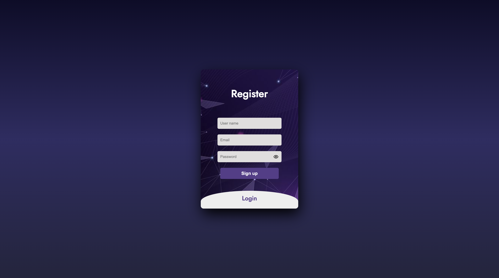
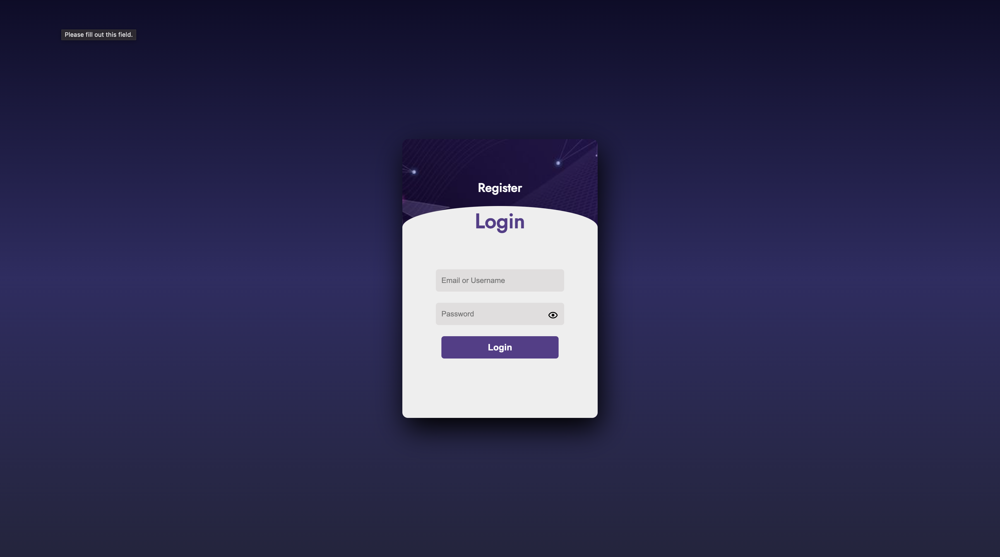
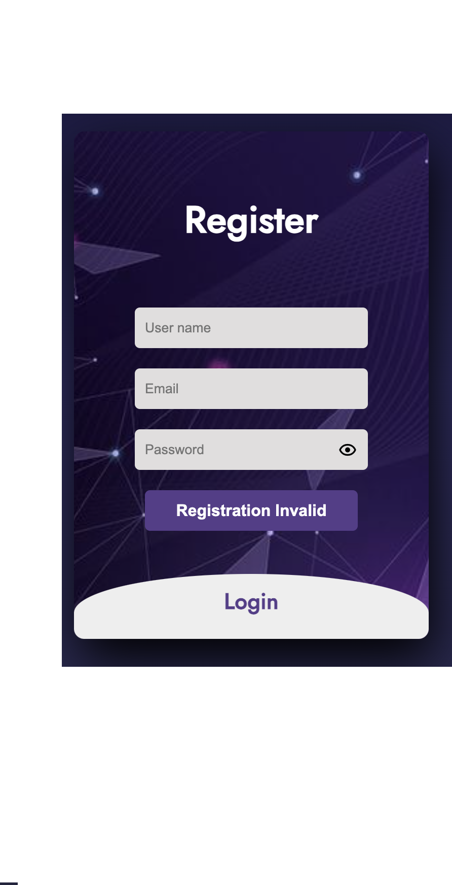

## Dependencies:

- Java EE 8
- Apache Tomcat 8.5.99
- JSP
- Servlet 4.0
- JDK 21.0.2
- JDBC 8.0.23

## Concept: 

Usage of MVC architecture to provide stable architecture for code readability:
[https://qiita.com/matsudai/items/81884c2ac75a5e024357](https://qiita.com/matsudai/items/81884c2ac75a5e024357)

- Controller: Web Servlets
- Form Bean: simple Java Pojo
- Model: contains the logic for DAO layer
- DAO: JDBC SQL query to database, has a interface to encapsulate/abstract logic

## How to setup/run this:
1. T
2. from the ROOT directoy of the project *.zip*, run the following command:
```bash
jar -cvf BuyMe.war -C src/main/webapp/ .
```
this will allow you to create the *.war* file to later be exploded and ran using Apache Tomcat Server.
3. Once you’ve created your *BuyMe.war* file, the next step is to deploy it. You should copy or move the file into the **_webapps/_** directory of your Tomcat server installation. 
This action will trigger Tomcat to automatically deploy the application upon startup or while running if auto-deployment is enabled. 
The specific location of the **_webapps/_** folder depends on your Tomcat setup and operating system.

4. Then once you have it, you can startup Tomcat and go to:
```angular2html
http://localhost:8080/BuyMe
```
and this should get you to the entry point of the website which is the login/register page which should look something like this:


*Note*: once the *.war* file is exploded, you should see a tree structure similar to this:
```shell
.
├── Images
│   └── 1.jpg
├── META-INF
│   ├── MANIFEST.MF
│   └── war-tracker
├── WEB-INF
│   ├── classes
│   │   ├── com
│   │   │   └── mybuy
│   │   │       ├── controller
│   │   │       │   ├── LoginServlet.class
│   │   │       │   ├── LogoutServlet.class
│   │   │       │   └── RegisterServlet.class
│   │   │       ├── dao
│   │   │       │   ├── ILoginDAO.class
│   │   │       │   ├── IRegisterDAO.class
│   │   │       │   ├── LoginDAO.class
│   │   │       │   └── RegisterDAO.class
│   │   │       ├── model
│   │   │       │   ├── Login.class
│   │   │       │   ├── LoginModel.class
│   │   │       │   ├── Register.class
│   │   │       │   └── RegisterModel.class
│   │   │       └── utils
│   │   │           ├── ApplicationDB.class
│   │   │           └── HashingUtility.class
│   │   └── config.properties
│   ├── lib
│   │   └── mysql-connector-java-8.0.23.jar
│   ├── view
│   │   └── welcome.jsp
│   └── web.xml
├── index.jsp
└── stylesheets
    └── loginAndRegisterStyle.css

14 directories, 22 files
```
## What Website does (so far):
1. Once you've deployed the *.war* file, you will be greeted with the following display:
   
2. This display can be toggled. So if you click **_Register_** or **_Login_** the stylesheet will move to show:
   
3. So now you can either register or login. If your registration was unsuccessful:
   
   If your login was unsuccessful:
   