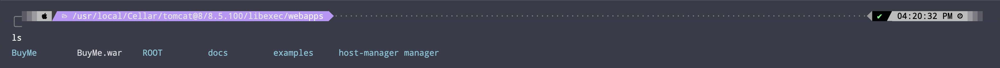
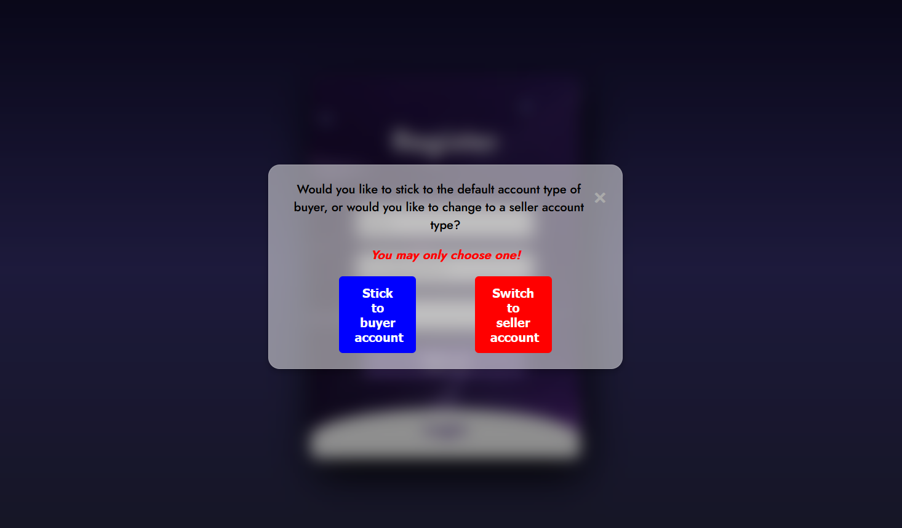

## Dependencies:

- Java EE 8
- Apache Tomcat 8.5.99
- JSP
- Servlet 4.0
- JDK 21.0.2
- JDBC 8.0.23
- Gson 2.8.8

## Concept:

Usage of MVC architecture to provide stable architecture for code readability:
[https://qiita.com/matsudai/items/81884c2ac75a5e024357](https://qiita.com/matsudai/items/81884c2ac75a5e024357)

- Controller: Web Servlets
- Form Bean: simple Java Pojo
- Model: contains the logic for DAO layer
- DAO: JDBC SQL query to database, has a interface to encapsulate/abstract logic
- SHA-256 Hashing Encryption Algorithm for hashing passwords into MySQL Database.

## How to setup/run this:
1. First configure **_config.properties_** located in *src/main/resources/* with your localhost usernmae and password for your database connection:
```properties
db.url=jdbc:mysql://localhost:3306/mybuy
db.user=root
db.password=bot67ham
```
change *db.username* and *db.password* to your root username or password for your MySQL database setup.

2. the **_schema.sql_** is located within the *db/* folder, but we have also simply provided the **_schema.sql_** in the canvas submission.

3. From the ROOT directory of the project *.zip*, run the following command:
```bash
jar -cvf BuyMe.war -C src/main/webapp/ .
```
this will allow you to create the *.war* file to later be exploded and ran using Apache Tomcat Server.
4. Once you’ve created your *BuyMe.war* file, the next step is to deploy it. You should copy or move the file into the **_webapps/_** directory of your Tomcat server installation.
   This action will trigger Tomcat to automatically deploy the application upon startup or while running if auto-deployment is enabled.
   The specific location of the **_webapps/_** folder depends on your Tomcat setup and operating system.

*Might look something like this:*


5. Then once you have it, you can startup Tomcat and go to:
```angular2html
http://localhost:8080/BuyMe
```
and this should get you to the entry point of the website which is the login/register page which should look something like this:


*Note*: Keep in mind that this is for MacOS using the *brew* package manager installation path. You will neeed to place according to your operating system but path might be something similar to this general location especailly for Linux/Unix distros.

**Make sure your local sql database host instance has started and is running on port 3306 to properly interact with the website.**

*Note*: once the *.war* file is exploded, you should see a tree structure similar to this:
```shell
.
├── Images
│   └── 1.jpg
├── META-INF
│   ├── MANIFEST.MF
│   └── war-tracker
├── WEB-INF
│   ├── classes
│   │   ├── com
│   │   │   └── mybuy
│   │   │       ├── controller
│   │   │       │   ├── LoginServlet.class
│   │   │       │   ├── LogoutServlet.class
│   │   │       │   └── RegisterServlet.class
│   │   │       ├── dao
│   │   │       │   ├── ILoginDAO.class
│   │   │       │   ├── IRegisterDAO.class
│   │   │       │   ├── LoginDAO.class
│   │   │       │   └── RegisterDAO.class
│   │   │       ├── model
│   │   │       │   ├── Login.class
│   │   │       │   ├── LoginModel.class
│   │   │       │   ├── Register.class
│   │   │       │   └── RegisterModel.class
│   │   │       └── utils
│   │   │           ├── ApplicationDB.class
│   │   │           └── HashingUtility.class
│   │   └── config.properties
│   ├── lib
│   │   └── mysql-connector-java-8.0.23.jar
│   ├── view
│   │   └── welcome_page_buyer.jsp
│   └── web.xml
├── index.jsp
└── stylesheets
    └── loginAndRegisterStyle.css

14 directories, 22 files
```
## What Website does (so far):
1. Once you've deployed the *.war* file, you will be greeted with the following display:
   
2. This display can be toggled. So if you click **_Register_** or **_Login_** the stylesheet will move to show:
   
3. So now you can either register or login. If your registration was unsuccessful:
   
   If your login was unsuccessful:
   
4. Now if registration is successful, you can choose to make a buyer or seller account:
   
5. Now if login is successful, you will be sent to the main page:
   
   Here if you click the *logout* button, it will send you back to the register/login page.
6. If you want to sign in as an Admin, you can use these credentials:
   
7. This will take you to the Admin page, which you can see here:
   
   From here you can create customer reps and see sales reports
8. If you login as a customer rep, it will take you to this page:
   
   Have fun exploring our site!

## Login and Password Credentials for atleast one user:

In the *schema.sql* file provided, you will see one users:

**Admin:**
```sql
-- inserting ONE admin into the database with hashed password and salt
-- actual password is "Admin" and "One_Admin" is username.
INSERT INTO Admin (admin_login, email_address, password, salt)
VALUES ("One_Admin", "onlyadmin@gmail.com", "e1d0253d7e5ce8c582aa07c01e5cdf6bbd4d97ed7edec1e3921d469e77b0ea7f", "9fcb340a561f0d91148e068d544d94de");
```
This password is obviously hashed using the algorithms expressed prior. The code should use the Salt stored in the database to decrypt and verify login details!
Due to the trigger added for Admin table, this will be the only one admin to be inserted. If you try to insert or register another admin (of course you can't register on frontend for an Admin or CustomerRep. account) it will give you database error from the database objet.

   
